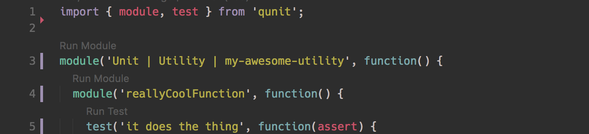

# VSCode Ember Test Runner
Run ember qunit tests filtered by module or specific test from within vscode.

## Features
Provides a code lens action with the text "Run Module" displayed over module
invocations and "Run Test" displayed over test invocations.

Clicking the code lens text should open the test runner in the default
browser, pre-filtered to the desired test string.

- Works with nested modules and scopes nested modules to the top level module.
- Scopes the test filter to the module (or modules) it is
contained within.

## Requirements
Make sure the tests are being served by running `ember test --serve` in the
root of the project.

## Extension Settings
This extension contributes the following settings:

* `vscode-ember-test-runner.testPageUrl`: set this to the url that should be used
when running tests. By default it is set to: "https://localhost:4444?hidepassed"

## Known Limitations
- Currently only supports qunit test syntax
- Does not work if test strings are constructed dynamically in loops or with variables
- Not tested with nested modules of more than 1 level deep
- Does not work with more than one top level module defined per file